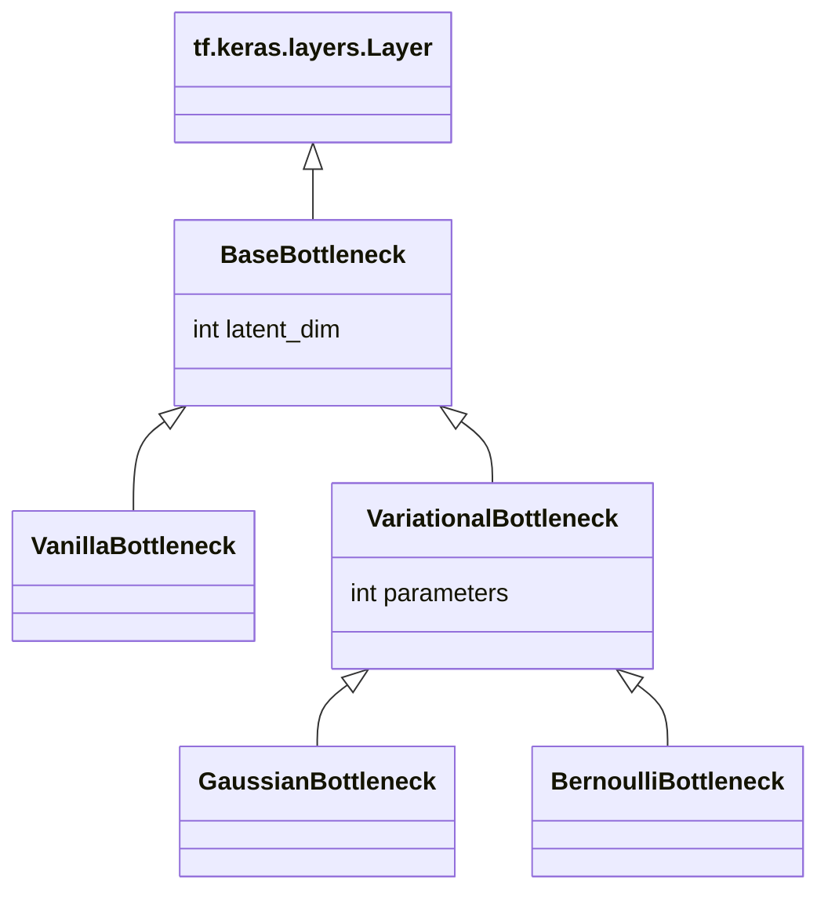
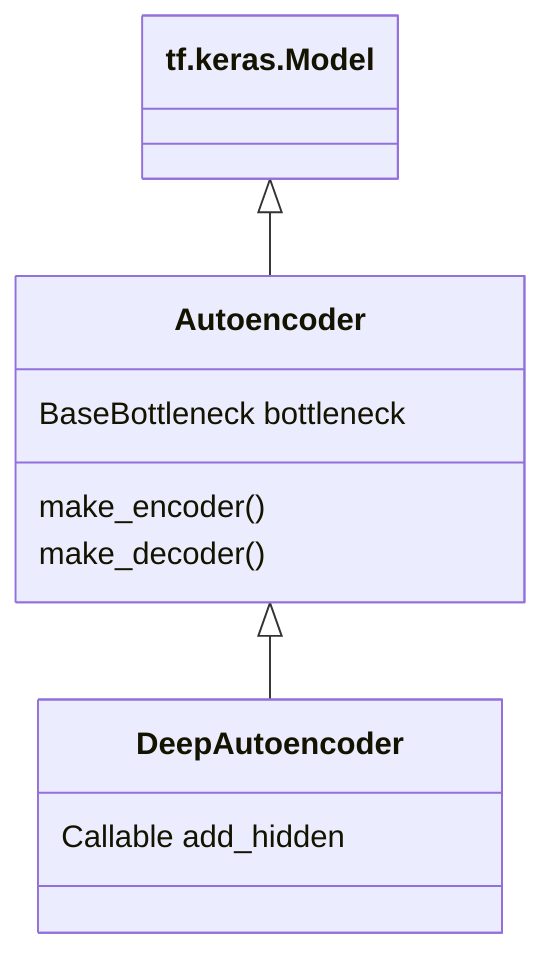
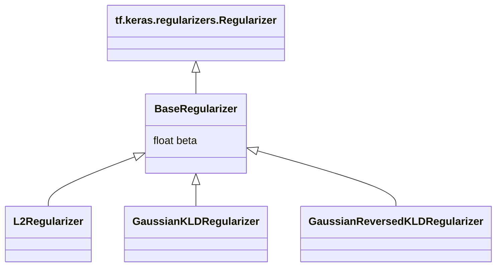
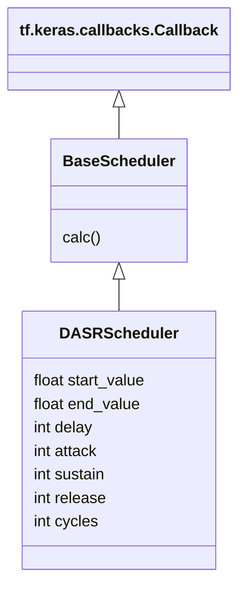

# TensorFlow Autoencoders (TFAE)
This package is a [TensorFlow](https://tensorflow.org/) extension for building and training different types of autoencoders.

## Table of contents
- [Motivation]()
- [Current package]()
- [Installation]()
- [Usage]()
- [API reference]()
- [Contribution]()

## Motivation

Autoencoders – AE – are widely used in various tasks: from computer vision to recommender systems and many others.

Tensorflow, being a flexible tool, does not provide AE-specific tools though.

The lack of such tools results into redundant code. Even [official tutorial](https://www.tensorflow.org/tutorials/generative/cvae) on this topic includes explicit looping through training steps and manual computation of losses and gradients.

Code like this is difficult to maintain.

TFAE makes process of building and training AEs easy yet flexible, keeping traditional TensorFlow style.

## Current package

TFAE is a set of extensions for standard Tensorflow classes, such as Layers and Models. These can be used to build a wide range of models: shallow and deep, classical and variational.

In addition to layers and models, it contains extensions for Regularizers and Callbacks, which are used to control the training process, such as [β-VAE](https://openreview.net/pdf?id=Sy2fzU9gl), [Cyclical β-annealing](https://arxiv.org/pdf/1903.10145.pdf) and others.

## Installation

TFAE can be installed directly from [PyPI](https://pypi.org/project/tfae/):

```console
pip install tfae
```
TensorFlow is the only dependency. Python 3.8-3.10 is required.

## Usage

Let's take a quick example.

Here we build and train shallow variational autoencoder regularized with KL-divergence:

```python
import tensorflow as tf

from tfae.models import Autoencoder
from tfae.bottlenecks import GaussianBottleneck
from tfae.regularizers import GaussianKLDRegularizer

model = Autoencoder(
    bottleneck=GaussianBottleneck(
        latent_dim=32,
        kernel_regularizer=GaussianKLDRegularizer(),
    ),
)

model.compile(...)

model.fit(...)
```

Now we can use this model to encode data:
```python
encoded = model.encoder.predict(...)
```

Or generate new samples:
```python
generated = model.decoder.predict(...)
```

Of course, it's possible to build deeper models and sophisticate training process.

Check out more examples:

- [Search similar movies using autoencoder](https://colab.research.google.com/drive/1RPX2j1q8EeMBc-QZBA667EiBsXSR34Bp?usp=sharing)
- [Generating handwritten digits with Convolutional Variational Autoencoder](https://colab.research.google.com/drive/1Lt1haqMNomDL8B1KZKDe9sHZu6y4eUmG?usp=sharing)

or explore API in the following section.

## API reference

TFAE includes:
- [bottlenecks](#bottlenecks)
- [models](#models)
- [regularizers](#regularizers)
- [schedulers](#schedulers)

### Bottlenecks

Bottlenecks are layers placed in the middle of a model, connecting encoder with decoder.

Every bottleneck extends `BaseBottleneck`, which in turn extends `tf.keras.layers.Layer`.

#### Vanilla bottleneck

`VanillaBottleneck` it's a "semantic stub" for a dense layer – the most simple autoencoder bottleneck.

#### Variational bottlenecks

`VariationalBottleneck` is a subclass for building model implementing variational inference. TFAE includes two bottlenecks for variational inference: Gaussian and Bernoulli:



### Models

TFAE includes two subclasses of `tf.keras.Model`: `Autoencoder` and `DeepAutoencoder`.



#### Autoencoder

`Autoencoder` represents a simplest form of autoencoder with only one hidden layer as a bottleneck. [See usage example](https://colab.research.google.com/drive/1RPX2j1q8EeMBc-QZBA667EiBsXSR34Bp?usp=sharing).

#### DeepAutoencoder

`DeepAutoencoder` extends `Autoencoder` and allows to build deeper models in a functional way: it's `add_hidden` method constructs additional hidden layers.

Let's take a quick example how `add_hidden` works.

It takes four parameters:
- input layer
- number of current layer
- shape of the input layer
- dimensionality of the bottleneck

And returns a tuple of a new layer and a boolean indicating that current layer is the last.

This method is applied to both, encoder and decoder (but for decoder in a "mirror manner").

The following example demostrates how to create encoder and decoder with two hidden layers each. And both have a pyramidal structure:

```python
from tfae.models import DeepAutoencoder

def add_hidden(
    x: tf.keras.layers.Layer,
    layer_num: int,
    input_shape: tf.TensorShape,
    latent_dim: int,
) -> tuple[tf.keras.layers.Layer, bool]:

    number_of_hidden_layers = 2

    divisor = (latent_dim / input_shape[-1]) ** (layer_num / (number_of_hidden_layers + 1))
    units = int(divisor * input_shape[-1])

    x = tf.keras.layers.Dense(units)(x)

    return x, layer_num == number_of_hidden_layers

model = DeepAutoencoder(
    bottleneck=...
    add_hidden=add_hidden,
)
```

#### Custom models

Custom models can be made by extending `Autoencoder` class. [See an example](https://colab.research.google.com/drive/1Lt1haqMNomDL8B1KZKDe9sHZu6y4eUmG?usp=sharing).

### Regularizers

It often proves useful to regularize bottleneck, so encoder could learn better and disentangled representation.

TFAE includes:
- `L2Regularizer` for `VanillaBottleneck`
- `GaussianKLDRegularizer` and `GaussianReversedKLDRegularizer` for `GaussianBottleneck`

Every TFAE regularizer extends `BaseRegularizer`, which contains property `beta: float` – regularization factor:



A custom regulirizer can be applied by extending `BaseRegularizer`.

### Schedulers

Recent papers has shown that constant regularization factor can be an obstacle on the way to the better latent representation:

- [β-VAE](https://openreview.net/pdf?id=Sy2fzU9gl)
- [Fixing Broken ELBO](https://proceedings.mlr.press/v80/alemi18a/alemi18a.pdf)
- [Cyclical Annealing Schedule](https://arxiv.org/pdf/1903.10145.pdf)
- [β-annealed VAE](https://ml4physicalsciences.github.io/2020/files/NeurIPS_ML4PS_2020_133.pdf)

All these papers are suggesting to vary regularization factor – let's call it `β` – over time.

TFAE contains `DASRScheduler` which can handle different schedules covering the aforementioned papers.

Every scheduler extends `BaseScheduler` which extends `tf.keras.callbacks.Callback`:



#### DASRScheduler

"DASR" stands for Delay, Attack, Sustain, Release.

Let's say in "phase 1" we want to keep `β=0` for first 5 epochs, then gradually rise it up to `β=1` for 10 more epochs. In "phase 2" we'll keep `β=1` until loss stops improving:

```python
from tfae.models import Autoencoder
from tfae.bottlenecks import GaussianBottleneck
from tfae.regularizers import GaussianKLDRegularizer
from tfae.schedulers import DASRScheduler

# Creating scheduler which will keep β=0 for 5 epochs
# and then gradually raise it up to β=1 for 10 more epochs:
scheduler = DASRScheduler(
    start_value=0.0,
    end_value=1.0,
    delay=5,
    attack=10,
)

# Note how we pass scheduler.value to the regularizer:
model = Autoencoder(
    bottleneck=GaussianBottleneck(
        latent_dim=32,
        kernel_regulirizer=GaussianKLDRegularizer(
            beta=scheduler.value,
        )
    )
)

model.compile(...)

# Phase 1.
#
# Scheduler have auto-calculated attribute "duration"
# which tells how many epochs it takes
# to go through all scheduled values of β.
# 
# We also pass scheduler as a callback
# so so that he can be updated:
model.fit(
    ...
    epochs=scheduler.duration,
    callbacks=[
        scheduler,
    ],
)

# Phase 2.
#
# Here we continue training until loss stops improving:
model.fit(
    ...,
    initial_epoch=scheduler.duration,
    callbacks=[
        tf.keras.callbacks.EarlyStopping(...),
    ]
)
```

Let's take one more example and implement schedule for [cyclical β-annealing](https://arxiv.org/pdf/1903.10145.pdf):

```python
scheduler = DASRScheduler(
    start_value=0.0,
    end_value=1.0,
    attack=10,
    sustain=10,
    cycles=4,
)
```